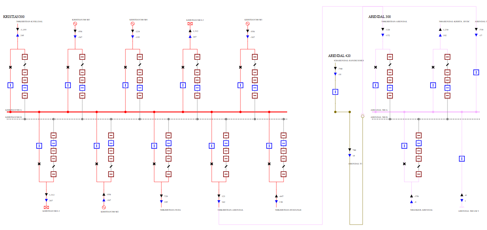
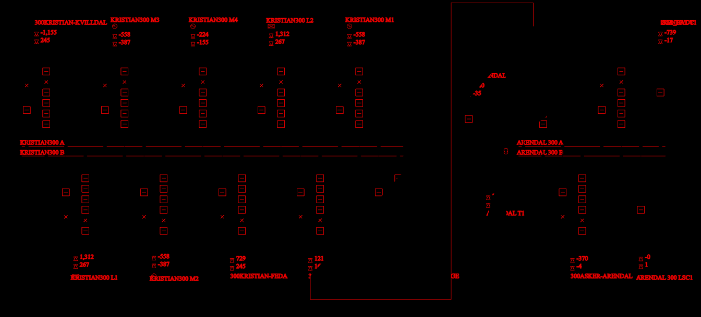
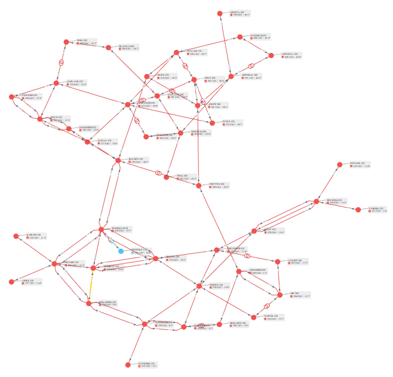
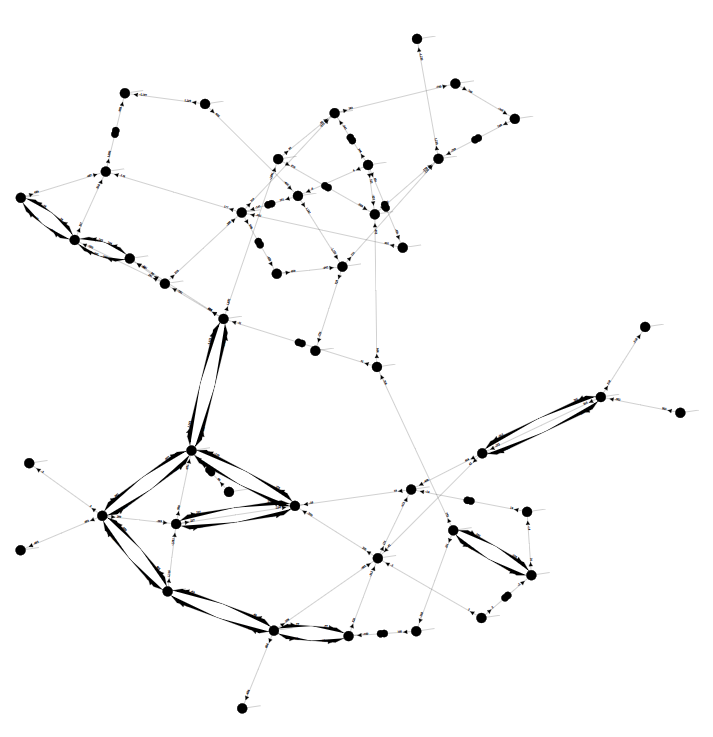

This is some simple analysis of what SVG IDs are used by PowSyBl in order to enable interaction on click
(task https://github.com/powsybl/powsybl-diagram/issues/754)

<!-- markdown-toc start - Don't edit this section. Run M-x markdown-toc-refresh-toc -->
**Table of Contents**

- [mRID Encoding](#mrid-encoding)
- [Other SVG IDs](#other-svg-ids)
- [Identifier Analysis](#identifier-analysis)
- [Identifier Pattern Analysis](#identifier-pattern-analysis)
- [Coverage Analysis](#coverage-analysis)
- [SLD vs NAD Diagrams](#sld-vs-nad-diagrams)
    - [SLD Diagrams: Clickable](#sld-diagrams-clickable)
    - [NAD Diagrams: Not Clickable](#nad-diagrams-not-clickable)
- [Summary](#summary)

<!-- markdown-toc end -->

## mRID Encoding
mRIDs are not used directly as SVG ID
(issue https://github.com/statnett/Talk2PowerSystem_PM/issues/261 ).

| mRID                                   | PSR                               | SVG ID                                                             |
|----------------------------------------|-----------------------------------|--------------------------------------------------------------------|
| `0169b8e7-c05b-3640-b55e-22b40081ca21` | Breaker "KRISTIAN300KV1 BB_S"     | `id0169b8e7_45_c05b_45_3640_45_b55e_45_22b40081ca21`               |
| `0345061e-37c9-9a49-b632-2af77bdca3a2` | Terminal "KRISTIAN300KV1 BD_S T2" | `id0345061e_45_37c9_45_9a49_45_b632_45_2af77bdca3a2_95_SW_95_fict` |

- `id` is prepended
- In some cases a "role" is appended, eg `SW_fict, NW_LABEL, ARROW_ACTIVE, ARROW_REACTIVE, ONE, ONE_N_LABEL`
- `-` is converted to `_45_` (hex encoding of "dash")
- `_` is convered to `_95_` (hex encoding of unicode "underscore")

## Other SVG IDs
There are also many SVG IDs that:
- Don't start with `id`
- Start with `id` but don't continue with a UUID. These fall in several cases:
  - `idEXTERN` don't relate to a mRID
  - `idLABEL_VL` are labels that pertain to a single mRID
  - `idEDGE` are small SVG elements that pertain to a single mRID, eg `idEDGE_f1769e1e-9aeb-11e5-91da-b8763fd99c5f_ONE`
  - `idINTERNAL` are a mix of 1, 2 or 2 pairs of repeated UUIDs
  - `idBUSCO` represent join points between two PSRs, eg: 

| mRID                                   | PSR                           | SVG ID (after decoding)                                                                                      |
|----------------------------------------|-------------------------------|--------------------------------------------------------------------------------------------------------------|
| `2dd90195-bdfb-11e5-94fa-c8f73332c8f4` | BusbarSection "KRISTIAN300 A" |                                                                                                              |
| `05d4226b-111b-f747-84b4-cc7be03f3544` | Breaker "KRISTIAN300L1  AB_S" | `idBUSCO_2dd90195-bdfb-11e5-94fa-c8f73332c8f4_05d4226b-111b-f747-84b4-cc7be03f3544`                          |
| `1f4fabd4-8c57-c245-b107-4e64c9007ae3` | VoltageLevel "ARENDAL 420"    |                                                                                                              |
| `368340e1-464b-814b-9bac-9b70b93dde72` | Breaker "ARENDAL 420T1  AB_S" | `idBUSCO_INTERNAL_1f4fabd4-8c57-c245-b107-4e64c9007ae3_0_FictitiousBus_368340e1-464b-814b-9bac-9b70b93dde72` |


## Identifier Analysis
The `Makefile` produces several extractions of SVG IDs for comparison.
We analyze [PowSyBl-SLD-2substations-KRISTIANSAND-and-ARENDAL.svg](../svg/PowSyBl-SLD-2substations-KRISTIANSAND-and-ARENDAL.svg) as an example

The analysis files are described below:

| count | file             | comment                                                       |
|-------|------------------|---------------------------------------------------------------|
|   498 | id-all.txt       | All SVG IDs (including refs and defs)                         |
|   491 | id-all-uniq.txt  | Uniqie SVG IDs (defs)                                         |
|   491 | id-all-norm.txt  | Unescaped ( `_45_` to dash, `_95_` to underscore)             |
|   188 | id-uuid-all.txt  | SVG IDs starting with `id` and UUID                           |
|   188 | id-uuid-uniq.txt | Unique                                                        |
|   188 | id-uuid-norm.txt | Unescaped ( `_45_` to dash, `_95_` to underscore)             |
|   106 | patterns.txt     | SVG ID patterns where UUIDs are replaced with the word `UUID` |
|   196 | svg-words.txt    | All UUID or words, split at `_`,  unique                      |
|   166 | svg-dedup.txt    | Collapse two same UUIDs to one, split off `ONE-` and `fict-`  |
|   129 | uuid-mrid.txt    | Starting with `id` and UUID, cut off at first `_`, unique     |

## Identifier Pattern Analysis
There are 106 patterns, and we comment on a couple of them:
- These are the 71 pure mRIDs (no suffix):
```
     71 id="idUUID"
```
- There are 52 with role `SW_fict`:
```
     52 id="idUUID_SW_fict"
```
- There are a variety of `LABEL` SVG elements:
```
      4 id="idUUID_ONE_S_LABEL"
      4 id="idUUID_N_LABEL"
      4 id="idUUID_NW_LABEL"
        etc
```
- The longest SVG IDs combine up to 7 MRIDs: 3 pairs and 1 standalone, eg:
```
     13 id="_UUID_INTERNAL_UUID_BUSCO_UUID_UUID_SW_fict-_UUID_SW_fict_BUSCO_UUID_UUID_SW_fict"
      1 id="_UUID_INTERNAL_UUID_BUSCO_INTERNAL_UUID_0_FictitiousBus_UUID-_UUID_BUSCO_INTERNAL_UUID_0_FictitiousBus_UUID"
```

## Coverage Analysis

There are a lot more SVG IDs used for various sub-elements, than PSR mRIDs.
So we need to analyze whether the simple rule used for `uuid-mrid.txt` catches all mRIDs.

The following command shows that:
- `svg-dedup.txt` fully covers `uuid-mrid.txt`
- Any extra stuff in `svg-dedup.txt` are words other than mRIDs:

```
comm -3 svg-dedup.txt uuid-mrid.txt
```
The result is shown on a single line:

0 1 11 12 19 2 20 21 23 24 27 3 32 4 5 6 7 8 9 ACTIVE ARROW BUSCO EDGE EXTERN FictitiousBus INTERNAL LABEL N NW ONE REACTIVE S SW TWO VL fict

## SLD vs NAD Diagrams

We wrote a simple JS that replaces SVG styles with `stroke=red, color=red` for clickable elements, and `black` for non-clickable elements
(it is embedded in the HTML files referenced below).

In this way we can examine which SVG elements are clickable, and compare the relative area of clickable vs non-clickable.

### SLD Diagrams: Clickable
The above `id` analysis is about SLD (Single-Line-Diagrams).
Here is an original SLD diagram:



[svg-color-SLD.html](https://raw.githack.com/statnett/Talk2PowerSystem/main/diagram/svg-click/svg-color-SLD.html) forces the colors: red is clickable and black is not:



### NAD Diagrams: Not Clickable
Unfortunately NAD (Network-Area-Diagrams) don't have any mRIDs: all identifiers are sequential numbers.



No NAD elements are clickable, as you can see here: [svg-color-NAD.html](https://raw.githack.com/statnett/Talk2PowerSystem/main/diagram/svg-click/svg-color-NAD.html):



## Summary
In summary, our analysis suggests the following algorithm for associating an SVG ID to a mRID:
- When the user clicks on an SVG element, take its ID
- Globally replace `_45_` to dash, `_95_` to underscore
- If it doesn't start with `id`, skip it. Else remove this `id`
- If it doesn't start with a UUID (optionally followed by underscore), skip it
- Else return this UUID

In other words, you could use the following regex replaces to find the mRID
```perl
s{_45_}{-}g; s{_95_}{_}g;
s{^id([0-9a-f]{8}-[0-9a-f]{4}-[0-9a-f]{4}-[0-9a-f]{4}-[0-9a-f]{12})(_.*)?$}{$1}
```
(The second replacement must succeed)
